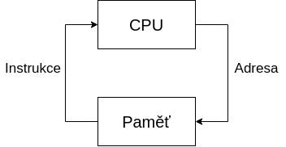
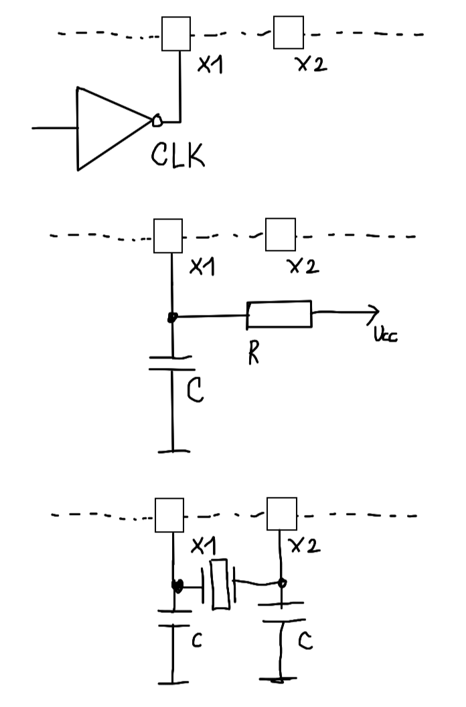
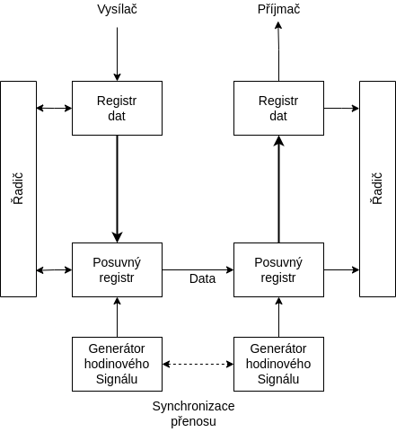
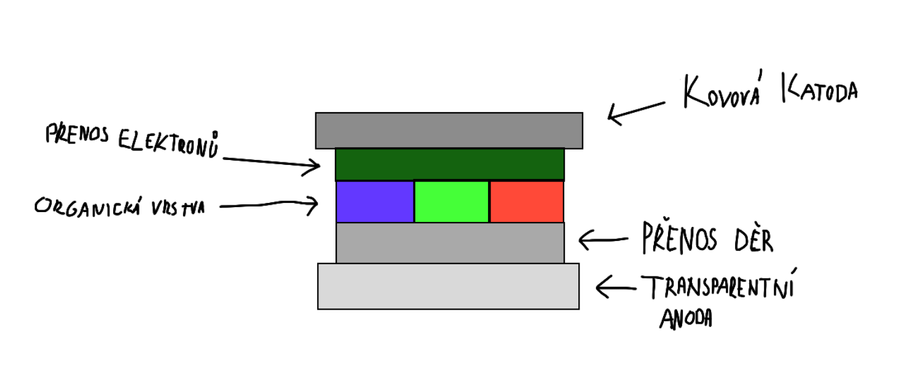
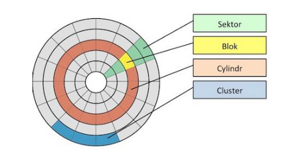
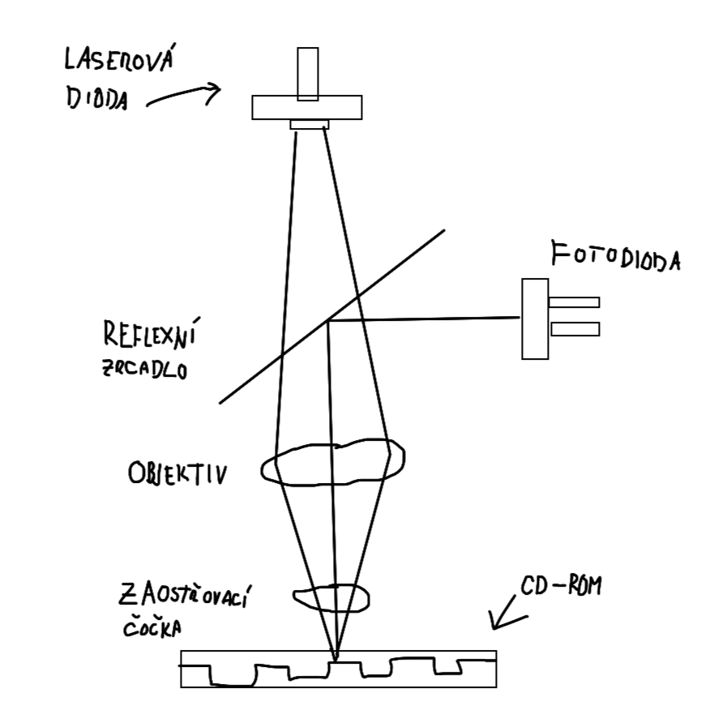

<!--  ----------  -->
# 1. Architektura počítačů

### Jaké jsou základní principy fungování počítače?
- Počítač je programován obsahem paměti
- Instrukce se vykonávají sekvenčně
- Každý následující krok závisí na tom předchozím

- Procesor si přes sběrnici vyžádá instrukci z paměti na adrese IP
- Poté co instrukci získá ji provede
- Zvýší IP/PC 
- Cyklus čtení a provedení se opakuje

### Kritéria a Principy dle von Neumanna:
- Počítač je řízen obsahem paměti (struktura počítače je nezávislá na typu úlohy)
- Strojové instrukce a Data jsou v jedné paměti (lze přistupovat jednotným způsobem)
- Paměť je rozdělena do buněk stejné velikosti (Jejich pořadové číslo je jejich adresa)
- Následující krok je závislý na tom přechozím
- Program je sekvence instrukcí, ty jsou vykonávány sekvenčně, v pořadí v jakém jsou zapsány do paměti
- Změna pořadí instrukcí je možná pomocí skoku
- Pro reprezentaci čísel, adres, znaků.. se používá dvojková soustava

### Jaké má výhody a nevýhody architektura dle von Neumanna?
- Výhody
    - Rozdělení paměti pro kod a data určuje programátor
    - do paměti se přistupuje stejném způsobem pro data i instrukce
    - jedna sběrnice => jednodušší výroba
- Nevýhody
    - jedna paměť může mít při chybě za následek přepsání vlastního programu
    - jediná sběrnice je úzké místo

### Přinesla harvardská architektura nějaká vylepšení proti von Neumannově?
- Oddělení paměti dat a programu
    - Program už nemůže přepsat sám sebe
    - Paměti můžou být vyrobeny různými technologiemi
    - Dvě sběrnice umožňují přistupovat k instrukcím a datům zárověň
- Nevýhody:
    - dvě sběrnice jsou dražší
    - nevyužitou část paměti dat nelze použít pro program.. a naopak

### Jaká je podpora paralelismu u obou architektur počítačů?
- Žádná .. instrukce jsou vykonávány sekvenčně, následující krok je závislí na tom předchozím
- Paralelizmy se musí simulovat až na úrovni OS

### Je lepší mít oddělené paměti pro data i program? Proč ano a proč ne?
- Ano
    - Program nemůže přepsat sám sebe
- Ne 
    - Jedna sběrnice => jednodušší výroba
    - Rozdělení pro kod a data určuje programátor 
    - Lze efektivněji využít kapacitu paměti

### Může fungovat počítač bez paměti či bez periferií?
- NE.. jak pravil von Neumann .. je potřeba procesoru, paměti a periferii

### K čemu se v počítači využívá dvojková soustava?
- Pro reprezentaci čísel, adres, znaků..

### Zvyšují sběrnice výkon počítače?
- Ne přímo, ale mohou jej omezit

### Je možné, aby procesor prováděl instrukce jinak, než sekvenčně?
- NE instrukce se provádějí sekvenčně 

### Jak je v počítači organizovaná paměť?
- Je složená z za sebou jdoucích buňěk stejné velikosti (obvykle 8bit), jejich pořadové číslo se využívá jako jejich adresa 

# 2. Jazyk symbolických instrukcí
### Registry procesoru
- 64bit: RAX, RBX, RCX, RDX, RSI, RDI, RBP, RSP, R8 - R15
- 32bit: začínají E, R8D - R15D	(Zápis vyresetuje horní část Rxx !)
- 16bit: AX, BX ... , R8W - R15W
- 8bit: AH (high), AL (low), BH, BL .. (Jen ABCD, jsou rozděleny na high a low)
- RSP - stack pointer
- RIP - instruction pointer

### Adresování, spojování JSI a C.
- Adresování:
    - [Bázový + Indexový * měřítko + Konstanta]
    - Např: mov rax, qword [ rdi + rbx * 8 ] 
- Datové typy:
    - BYTE, WORD, DWORD, QWORD (8, 16, 32, 64 bit)
- Spojování:
    - JSI: píšeme “global” před funkce a proměnné z C

### Základní instrukce přesunu, bitové, logické, aritmetické.
- Přesunu:
    - mov, movzx, movsx (rozšíří i se znaménkem)
    - CMOVcc - podmíněný přesun (cc je podmínka.. např CMOVZ )
    - mov KAM, CO (mov CÍL, ZDROJ)
    - nelze přesouvat z paměti do paměti (musí to jít přes registr)

- Logické:
    - AND cíl, zdroj
    - TEST - stejně jako AND, ale neuloží výsledek
    - OR, XOR, NOT
- Bitové:
    - SHL, SHR (bitový posun)
    - BOR, BOL (bitová rotace)
- Aritmetické:
    - ADD, SUB, NEG, INC, DEC
    - CMP - stejně jako SUB, ale neuloží výsledek
    - MUL, IMUL, DIV, IDIV (I_ je pro znaménková čísla)

### Skokové instrukce nepodmíněné a podmíněné. Volání funkcí s parametry, návratovými hodnotami
- Skokové:
    - CALL - pro volání funkcí
    - JMP
    - Jcc:
        - pro testování bitů: JZ, JNE, JNZ..
        - pro porovnávání čísel: 
            1. Bezznaménkových:
                - A - above
                - B - below
            2. Znaménkových:
                - L - less
                - G - greater
- Návratová hodnota v RAX ( EAX, AX, AL)
- Parametry jsou v pořadí v RDI, RSI, RDX, RCX, R8, R9

<!--  ----------  -->
# 3. Komunikace s periferiemi

### Z jakých částí se skládá sběrnice a co je účelem jednotlivých částí?
- Sběrnice dělíme na Adresovou, Řícicí, Datovou
- Adresová
    - Přenáší adresy
    - Zdroj adresy je mikroprocesor
    - Počet bitů (vodičů) sběrnice odpovídá počtu bitů adresy
- Řídicí
    - Některé signály jsou generovány mikroprocesorem, některé jinými bloky
    - Nejčastější řídicí signály:
        - RESET
            - má každý mikroprocesor
            - uvede mikroprocesor do výchozího stavu
        - MEMORY READ (MR)
            - zabezpečuje časování čtení z paměti (nebo jiných bloků) 
        - MEMORY WRITE (MW)
            - zabezpečuje časování zápisu do paměti (nebo jiných bloků)
        - INPUT / OUTPUT READ / WRITE
            - pro čtení nebo zápis do zařízení
        - READY
            - připravenost obvodu
- Datová
    - Slouží pro přenos veškerých dat v počítači
    - Nedůležitější parametry jsou šířka (počet bitů) a časování
    - Šířka ovlivňuje rychlost komunikace
    - Lze ušetřit vodiče pomocí multiplexování

### Co to je adresní dekodér a kdy je potřeba jej použít?
- Když je paměťový prostor obsazen více jak jednou fyzickou pamětí nebo periferním zařízením
- Rozhoduje, které zařízení je ke komunikaci určeno
- Jeho výstupy jsou v podstatě Chip Select signály pro jednotlivé obvody
- Může být stavěn jako:
    - úplné dekódování adresy
    - neúplné dekódování adresy
    - lineární přiřazení adresy
    - univerzálním přiřazením adresy

### Řízení komunikace 
- 2 případy zahájení komunikace
    - z iniciativy programu
    - z iniciativy periferie
        - počítač se může nacházet ve stavu, kdy nemůže s periferii komunikovat
        - lze řešit:
            - obvodově (bez vědomí počítače)
            - příznakovým bitem <b>(Programové řízení)</b>
            - přerušením .. počítač se později vrátí tam, kde byl vyrušen <b>(Systém Přerušení)</b>
            - přímým přístupem <b>(DMA)</b>

### Jaký je princip komunikace s periferiemi pomocí V/V bran?
- Vstupně / Výstupní brána (Input/Output, I/O) je obvod, který zprostředkovává předávání dat mezi sběrnicí (počítače) a periferním zařízení (počítače)
- Dělíme na
    - S pamětí
    - Bez paměti
- Základem je záchytný registr s 3 stavovým vstupem

#### Nepodmíněný vstup a výstup dat:

- Při vstupu počítač vyšle signál RD, tím přikáže vstupnímu zařízení předat data do vstupní brány počítače
- Při vstupu počítač vyšle signál WR a výstupní zařízení převezme data
- Jednoduchý způsob, předpokládá, že je perif. zařízení pořád ready

### K čemu slouží u komunikace V/V bran indikátor a jaké přináší výhody?
-  Zajišťujě, že informace budou správně podány (další otázka)

### Popište, jak probíhá přenos dat pomocí V/V brány s indikátorem.

#### Podmíněný vstup a výstup dat

- Jsou-li poskytována platná data ze vstupu, pak se za pomocí STB(strobe) impulsu nastaví Q na 1
- Když je Q na 1, data jsou předány počítači pomocí impulsu RD a po přenosu je indikátor vynulován
- V opačném případě se nastavuje Q na 1, když jsou data převzata, pomocí ACK signálu

### Jaký je rozdíl mezi programově řízenou komunikací s perifériemi a pomocí přerušení?
- Programové:
    - Využívá instrukce pro vstup a výstup, ve spojení s instrukcemi pro testování logických proměnných a skoků
    - Prostě testuje stavové bity ..
- Přerušení:
    - Periferie aktivuje přerušovací signál, procesor přeruší program, přejde do obslužného režimu, poté pokračuje v provádění hl. programu tam, kde byl přerušen 

### Jaké výhody přináší řízení komunikace s využitím přerušení?
- Procesor pořád nemusí zbytečně testovat stavové bity => neztrácí výkon

### Z jakých částí se skládá řadič DMA?

- Registr dat - Obsahuje slovo pro přesun
- Registr adresy - Adresa hl. paměti kam bude slovo zapsány, nebo odkud bude přečteno
- Čítač přesunu - požadovaný počet slov, které mají být ještě přesunuty

### Jak probíhá přenos dat s použitím DMA?
1. Naprogramování procesorem bloku DMA
2. blok DMA spustí periferní zařízení, a čeká než zařízení bude připraveno data příjmou nebo vyslat
3. Procesor dokončí strojový cyklus a pak reaguje na žádost o DMA, přímý přístup se provadí během činosti procesoru.. blok DMA a procesor se střídají v používání paměti
4. Procesor vyšle vybrané jednotce ACK a uvolní sběrnici, jednotka pak pošle obsah registru adresy na addr. sběrnici a obsah registru dat na dat. sběrnici a čeká na provedení cyklu paměti.. pak obsah registru adresy zvětší o jedničku a čítač přesunu zmenší o jedničku.. pokud není nulový, testuje zda bylo předáno nové slovo do registru dat.. když ne, dočasně se ukončí přesun dat a přestane se vysílat žádost o DMA.. řízení je předáno procesoru
5. Procesor dále pokračuje v provádění svého programu do doby, než obrží další žádost o DMA
6. Pokud je obsah čítače přesunu nulový, blok DMA ukončí cel přesun a uvolní sběrnici 

### Jaké má výhody řadič DMA proti přenosu dat s využitím CPU?
- Všechno nemusí dělat procesor 

### I2C 
- Inter-Integrated Circuit
- Dvou-vodičová Sběrnice
    - <b>SDC</b> => Synchronous Clock
    - <b>SDA</b> => Synchronous Data
- Rozděluje připojená zařízení na:
    - Řídicí - <b>Master</b>
        - Zahajuje a ukončuje komunikaci
        - Generuje hodinový signál (SCL)
    - Řízené - <b>Slave</b>
        - Adresované Masterem
- Adresa zařízení:
    - Skládá se ze 7 bitů (horní 4 určuje výrobce, dolní 3 jdou nastavit libovolně)
- Komunikace:
    - V klidovém stavu je SCL a SDA na 1
    - Start:
        - SCL = Sestupná Hrana
        - SDA = Sestupná Hrana
    - Konec:
        - SCL = Náběžná Hrana
        - SDA = Náběžná Hrana
    - Po startu následuje 7bit adresa cílového zařízení (Slave) a 1 bit Read nebo Write z pohledu mastera
        - 0bAAAAAAAM (A je bit adresy a M je Read/Write)
    - Dále slave vygeneruje ACK
        - Když je ACK 0, vše je Ok
        - Když je ACK 1, slave nereaguje
    - Na konci přenosu se posílá NACK

# 4. CISC A RISC

### Kdy a proč se začaly procesory dělit na RISC a CISC?
- V 70. letech, kvůli narůstající složitosti procesorů .. 

### Jaké byly zásadní důvody, proč se začaly procesory RISC vyvíjet?
- Výzkumy ukázaly, že programátoři a compilátory používají instrukce velmi nerovnoměrně  (v 50% případů se vyskytují pouze 3 instrukce)
- Snahy o nalezení optimálního instrukčního souboru => vznik RISC

### Jaké jsou základní konstrukční vlastnosti procesorů RISC?
- Malý instrukční soubor
- V každém strojovém cyklu by měla být dokončena jedna instrukce
- Zřeťezené zpracování instrukcí 
- Data jsou z hlavní paměti vybírána a úkládána výhradně pomocí <b>LOAD</b> a <b>STORE</b> instrukcí
- Instrukce mají pevnou délku a jednotný formát
- Je použit vyšší počet registrů
- Složitost se přesouvá na optimalizující kompilátory

### Jak přispěly jednotlivé charakteristické vlastnosti procesorů RISC ke zvýšení výpočetního výkonu?
- Jednotná délka instrukcí => rychlejší výběr instrukcí z paměti => lepší plnění fronty instrukcí 
- Jednotný formát => zjednodušuje dekódování
- Zřetězené zpracování instrukcí 

### Jaký je princip zřetězeného zpracování instrukcí v RISC procesorech?
- Provedení instrukce musí vždy projít stejnými fázemi (né nutně těma co jsou na obrázku)
- Funguje jako "výrobní linka" 

CISC:

|    | T1 | T2 | T3 | T4 | T5 | T6 | T7 | T8 | T9 | T10 | T11 | T12 |
|----|----|----|----|----|----|----|----|----|----|-----|-----|-----|
| VI | I1 |    |    |    |    |    | I2 |    |    |     |     |     |
| DE |    | I1 |    |    |    |    |    | I2 |    |     |     |     |
| VA |    |    | I1 |    |    |    |    |    | I2 |     |     |     |
| VO |    |    |    | I1 |    |    |    |    |    | I2  |     |     |
| PI |    |    |    |    | I1 |    |    |    |    |     | I2  |     |
| UV |    |    |    |    |    | I1 |    |    |    |     |     | I2  |

RISC:

|    | T1 | T2 | T3 | T4 | T5 | T6 | T7 | T8 | T9 | T10 | T11 | T12 |
|----|----|----|----|----|----|----|----|----|----|-----|-----|-----|
| VI | I1 | I2 | I3 | I4 | I5 | I6 | I7 |    |    |     |     |     |
| DE |    | I1 | I2 | I3 | I4 | I5 | I6 | I7 |    |     |     |     |
| VA |    |    | I1 | I2 | I3 | I4 | I5 | I6 | I7 |     |     |     |
| VO |    |    |    | I1 | I2 | I3 | I4 | I5 | I6 | I7  |     |     |
| PI |    |    |    |    | I1 | I2 | I3 | I4 | I5 | I6  | I7  |     |
| UV |    |    |    |    |    | I1 | I2 | I3 | I4 | I5  | I6  | I7  |

Legend:

| short name | full name           |
|------------|---------------------|
| VI         | Výběr Instrukce     |
| DE         | Dekodování          |
| VA         | Výpočet Adresy      |
| VO         | Výběr Operandu      |
| PI         | Provedení Instrukce |
| UV         | Uložení Výsledku    |

### Jakého zrychlení lze zřetězeným zpracováním instrukcí dosáhnout?
- V ideáním světě, při délce zřetězení 6-ti instrukcí, udělá během 12 cyklů
    - <b>CISC:</b> 2 instrukce
    - <b>RISC:</b> 7 instrukcí 
- viz. tabulky v minulé otázce

### Jaké problémy přináší zřetězené zpracování instrukcí v procesorech RISC?
- Datové a strukturální hazardy 
    - Datové: Když instrukce potřebuje mít k dispozici data předchozí instrukce ( a ta ještě nejsou k dispozici)
    - Struktrální: Problém omezených prostředků procesoru (a počítače jako celku) .. např. jen jedna sběrnice
- Problémy plněním fronty instrukcí
    - Podmíněné skoky
    - Nepodmíněné skoky na adresu, která se musí vypočítat

    
### Co to je predikce skoků, proč se používá a jaké způsoby predikce se využívají?
- Statická 
    - Do instrukce se vkládají příslušné bity již při kompilaci (nebo programátorem při psaní programu)
- Dynamická
    - Během běhu programu se zaznamenává, jestli se skok provedl, nebo ne
- Může být:
    - Jedno bitová
    - Dvou bitová

### Co to jsou datové a strukturální hazardy v RISC procesorech? Co je způsobuje?
- uvedeno výše..

### Jak funguje dvoubitová dynamická predikce skoků a proč se využívá?
- Jako čtyř stavový automat

- `A` predikuje provedení skoku, `N` říká, že skok provádět nebude
- `a` a `n` přechody označují, zda se skok naposledy prováděl

# 5. x86 Intel historie
- <b>8080</b>
    - Není x86
- <b>8086</b>
    - Prvním 16-bit
- <b>8088</b>
    - Sběrnice zúžená na 8bit
    - Jinak stejné jak 8086
- <b>80186</b>
    - Navržen pro embedded (vestavěná) zařízení
    - Má DMA
    - Vyráběn 25 let
- <b>80286</b>
    - Lze přepnout do <b>Protected modu</b> (4 úrovně oprávnění)
    - <b>Real mode</b> (pro zpětnou kompatibilitu, RM programy nemůžou fungovat v novém PM)
    - má MMU (memory management unit)
- <b>80386dx a sx</b>
    - sx je downgrade dx
    - První 32bit
    - Přidán <b>Virtual Mode</b> (po přepnutí do PM, bylo možnost vykonávat RM programy)

- <b>8087/287/387</b>
    - Matematick koprocesor, pro práci s floaty, který byl zvlášt
- <b>80486dx (později i sx verze)</b>
    - Dvojnásobný výkon při stejné frekvenci, než 386
    - L1 přímo v procesoru
    - Integrace matematického koprocesoru
- <b>Pentium</b>
    - První procesor v řadě x86, kde jsou uplatněna technická řešení typická pro <b>RISC</b>
    - L1 rozdělena na kod a data
    - Predikce skoků
- <b>Pentium Pro</b>
    - <b>ZÁSADNÍ</b> technologický zlom
    - Pro servery (=> velký výkon(zhruba o 50% víc než pentium) a cena)
    - L2 přímo na procesoru
    - Fetch/Decode jednotka dekoduje x86 instrukce na 118bit RISC instrukce (které intel pojmenoval jako mikro-operace)
    - Instrukce jsou po dekodování uloženy do banky instrukcí (Instruction pool), vejde se tam až 40 instrukcí
    - Dispatch/Execute jednotka si může vybírat instrukce mimo pořadí z poolu (Out of order execute)
    - 10 úrovňové zřetězení
    - Predikce skoků si pamatuje 512 hodnot

- <b>Pentium 2</b>
    - Vychází z Pentia Pro
- <b>Pentium 3</b>
    - Optimalizace z hlediska spotřeby
    - Dobré pro přenosné počítače
- <b>Pentium 4</b>
    - Mikroarchitektura <b>NetBurst</b>
    - Při stejné frekvenci jako P3 měl stejný výkon+-, ale více se zahříval
    - 20 úrovňové zřetězení
- <b>Pentium EM64T</b>
    - Extended Memory 64 Technology (Později jen Intel64)
    - První 64bit procesor
    - 30 úrovňové zřetězení
    - Velice se přehřívaly 
- <b>Pentium M</b>
    - Určeny pro přenosné počítače
    - Výkonný procesor s nízkou spotřebou energie
    - Obdobný výkon jako P4 při nižší frekvenci a třetinové spotřebě
- <b>Core</b>
- <b>Core 2</b>
- <b>Atom</b>

# 6. Paměti

### Dle jakých kritérií či vlastností se dělí paměti počítačů?
- Typu přístupu
    - RAM (Random access memory) - libovolný přístup
    - SAM (Serial acess memory) - Seriový přístup
    - Speciální (paměť typu zásobník, fronta..)
- Možnosti zápisu/čtení
    - RWM (Read write memory) - pro zápis a čtení
    - ROM (Read only memory) - pouze pro čtení
    - Kombinované
        - NVRAM (Non volatile RAM)
        - WOM (Write only memory)
        - WORM (Write once - ready many times memory) - optické disky
- Principu elementární buňky
    - SRAM - statické paměti
    - DRAM - dynamické paměti
    - PROM, EPROM, EEPROM, FLASH - programovatelné paměti
- Uchování informace po odpojení napájení
    - Non-Volatile - Zachovají si informaci i po odpojení napájení
    - Volatile - Ztráci informaci po odpojení napájení (DRAM a SRAM)

### Jak je v dynamických pamětech ukládána informace a jak je udržována?
- Ve formě náboje v kondenzátoru
- Zapomenou svá data cca po 10ms
- Proto je nutné obnovovat napětí kondenzárorů - <b>Refresh</b> 

### Jaká je vnitřní organizace dynamických pamětí?
- Ve čtvercové matici v jedné, nebo více vrstvách
- Výběr buňky tak musí být proveden pomocí row a column dekodéru
- DRAM čte adresu po dvou částech (adresa řádku a sloupce) do adresového bufferu
- [Organizace paměti, strana 5](https://poli.cs.vsb.cz/edu/apps/down/pameti.pdf)

### Popište stručně historii vývoje dynamických pamětí.
- ??? :c

### Jak je ve statických pamětech ukládána informace a jak je udržována?
- Je uložená stavem klopného obvodu
- Lze realitovat pomocí 4 nebo 6 tranzistorů
- SRAM je dražší a pojme méně dat něž DRAM

### Jak je organizována vnitřně statická paměť?
- Jako 2D mřížka, kde jeden řádek tvoří jedno slovo
- SRAM paměti nevyužívají adresní multiplexing

### Jaké typy pamětí si udržují svůj obsah i po odpojení napájení?
- (Nevolatilní)
- ROM (Read Only Memory)
    - Informace zapisuje výrobce (je složená z odporů, které výrobce přepálí.. neporušené prvky pak vedou proud a je v nich minimální napětí.. log. 0)
    - Doba pamatování není ohraničená
- PROM
    - Programmable ROM
    - Informace se vypalijí pomocí "programátoru"
    - Lze zapsat jen jednou
- EPROM
    - Erasable PROM
    - Uchovává informaci díky kvalitně izolovaném el. napětí
    - K naprogramování je potřeba až 50ms trvající pulz o 5V
    - Lze vymazat pomocí UV záření
    - Doba pamatování 10 až 20 let
- EEPROM
    - Electrically Erasable PROM
    - Zápis stějně jak EPROM
    - Mazální pomocí el. pulzu s obrácenou polaritou
    - Doba pamatování 10 až 20 let
- FLASH
    - Lze programovat rychle přímo v počítači
    - Doba pamatování 10 až 100 let
    - Struktura buněk je podobná EEPROM, ale pro programování a mazání stači pulz 10us
    - Před 10000 programovacích a mazacích cyklů

### Paměti s trvalým obsahem umožňují svůj obsah přepsat. Jak se přepis u jednotlivých typů provádí?
- EPROM - UV zářením
- EEPROM - Elektricky, až 50ms pulzem o 5V
- FLASH - Elektricky 10us pulzem

### Jaké speciální typy pamětí se používají?
- VRAM (Video RAM)
    - Dvouportová
    - Zvýšené přenosové pásmo
- WRAM (Window RAM (nemá nic společného s tím pseudo operačním systémem))
    - O 25% větší přenosové pásmo než VRAM
    - Nabízí double-buffering
- SGRAM (Synchroní Grafická RAM)
    - Funguje jako SDRAM
    - Ale SDRAM je optimalizována pro kapacitu a SGRAM pro přenos dat
- FIFO paměti (fronta)
    - Bez přesouvání obsahu
    - S přesouváním obsahu
- Cache paměti
    - Malé a rychlé
    - Rychlé komponenty čtou data z cache a nemusí čekat na komponentu pomalejší
    - L1,L2,..

### Hierarchie pamětí v počítači

### Jak se u pamětí detekují a opravují chyby?
- SRAM je spolehlivější než DRAM
- Tvrdé chyby - opakující se 
- Měkké chyby - Neopkající se .. těžší rozpoznat
- Kontrola Parity
    - dorovnává se na lichý počet jedniček do 9. bitu
    - neopravuje, jen detekuje chybu (když je počet jedniček sudý)
- ECC - Error Correction Code
    - Detekuje více bitové chyby
    - Schopen opravit 1 bitovou chybu
    - Nutnost "Wait State" => zpomalení 2-3%

# 7. Monolitické počítače
- Monolit = Procesor, Paměť, Periferie v jednom pouzdře
- Používá se převážně Hardvardská architektura
- Kvůli jednoduchosti bývají převážně RISC

### Jaká je obvyklá organizace pamětí v mikropočítačích?
- Střádačové (pracovní registry)
    - Většinou jen jeden, nebo dva
    - Ukládájí se do nich aktuálně zpracovávaná data
- Univerzální zápisníkové registry
    - Pro nejčastěji používaná data
- Paměť dat RWM
    - Pro rozsáhlejší a méně používaná data
- Speciální - např. IP
- Zásobník pro návratové adresy (nutnost mít stack pointer)

### Jaké zdroje hodinového signálu se mikropočítačích používají?
- (Zdroj synchronizace)
- Často je zdroj integrován přímo v počítači - nelze zajistit dobrou stabilitu (Vlivem teplot můžou být odchylky kmitočtu desítky %)
- Generátory:
    - Krystal (Dobrý pro stabilitu)
    - Keramický rezonátor
    - Obvod LC
    - Obvod RC (Pro minimalizaci ceny)
    - Externí zdroj

### Jak probíhá RESET mikropočítače?
- Počáteční stav počítače
- Po provedení RESETu se u všech počítačů nastaví počáteční hodnota čítače instrukcí (0 nebo samé 1)
- Výrobce definuje jako dlouho RESET signál trvá
- Zdroj signálu může být vnější nebo vnitřní

### Jakými způsoby se řeší ochrana proti rušení v mikropočítačích?
- Mechanická ochrana - musí odolávat nárazům, nebo trvalým vibracím
- Galvanické oddělení - proti elektromagnetickým vlivům
- WATCHDOG - aby nám program nezabloudil 
- Větším rozsahem pracovního napětí

### Jaké jsou základní vlastnosti V/V bran?
- Nejčastější a nejjednodušší je `Paralelní brána - port`
    - Obvykle organizovaná jako skupina 4 nebo 8 jednobit vývodů

### Popište obecný princip fungování sériových rozhraní? Jaká sériová rozhraní znáte?
- Dovoluje efektivním způsobem přenášet data na relativně velké vzdálenosti při použití minimálního počtu vodičů
- Je to celkem pomalá komunikace
- Dle vzdálenosti přenosu dělíme na:
    - Mezi elektronickými zařízeními (na delší vzdálenost)
        - Synchroní nebo asynchroní přenos
        - Typicky pomocí RS232 nebo RS485
    - Uvnitř el. zařízení
        - Typickým standardem je I2C 
- Princip ???

### K čemu slouží v mikropočítačích čítače a časovače? Jak fungují?
- Čítač je registr o N bitech, který nejčastěji čítá vnější události
    - Při přetečení se obvykle automaticky předává výzva do přerušovacího podsystému.
- Časovač je podobný jako čítač, ale je inkrementován vnitřním hodinovým signálem 
    - Zajišťuje řízení událostí v realném čase

### Popište konstrukci a fungování základních A/D převodníků.
- Převádí Analogový signál na Digitální
    - Komparační A/D převodník
        - Porovnává měřené veličiny s referenční hodnotou
        - Rychlé
        - S počtem komparátorů roste rozlišovací schopnost
    - A/D převodník s D/A převodem
        - pro sledování pomalu rostoucích veličin
        - Používá se jeden komparátor a proměnný zdroj referenční hodnoty
        - Sledovací
            - Mění vždy referenční hodnotu o krok nahoru nebo dolů
        - Aproximační
            - Půlení intervalu
    - Integrační A/D převodník
        - Metoda dvojité integrace
    - Převodník s časovacím RC článkem
        - Měří se doba nabití a vybití kondenzátoru

### Popište konstrukci a fungování základních D/A převodníků.
- Převádí digitální signál na analogový
- PWM (Pulse Width Modulation)
    - Převodníky mají velké zpoždění
    - Pro převod slouží RC článek
    - Hodnota Analog. signálu je "zakódována" jako poměr mezi stavy vypnuto a zapnuto
- Paralelní převodníky
    - Přímý převod číselné hodnoty na stejnosměrný proud
    - Základem je většinou odporová síť
    - Typy:
        - Váhově řazené hodnoty odporů (1:2:4:8..64:128) (náročné dodržet poměr kvůli přesnosti odporů)
        - R-2R

### NÁKRES A/D D/A ???

### Jaké speciální periferie mikropočítačů znáte?
- Řízení dobíjení baterií
- Vysílače a příjmače IR signálu
- USB rozhraní typu klient
- Řadiče LCD a LED

# 8. Monitory
### Jak funguje CRT ???

### Na jakých principech fungují LCD monitory?
- Liquid crystal display
- Každý pixel se skládá z 3 sub pixelů
- Jádrem LCD je TN (twisted nematic) struktura, která je z obou stran obklopena polarizačními vrstvami
- Princip (TN):
    - Světlo projde prvním filtrem a polarizuje se
    - Projde vrstvami pootečených tekutých krystalů, které světlo otočí o 90stupnu
    - Světlo projde i druhým polarizačním filtrem, které je otočeno o 90stupnu proti prvnímu
    - (TN-LCD, které v klidovém stavu bez přivedeného napětí propouští světlo)
    - Po přivedení napětí nématická struktura přestane otáčet světlo, a druhý polarizační filtr ho nepustí

(tady světlo otáčí == pixely jsou zaplé)
- 2 typy:
    - TN - v klidovém stavu svítí
    - IPS - v klidovém stavu nesvítí

### Jaké jsou základní výhody a nevýhody LCD monitorů?
- Výhody:
    - Kvalita obrazu
    - Životnost 
    - Spotřeba energie
    - Odrazivost
    - Bez emisí
- Nevýhody:
    - Citlivost na teplotu
    - Pevné rozlišení
    - Vadné pixely
    - Doba odezvy
    - Není úplně černý, kvůli podsvícení

### Jak fungují OLED zobrazovací jednotky?
- Organic Light Emmiting Diode

- Při přivedení napětí, se elektrony(záporné částice) začnou hromadit v organické vrstvě, blíže k anodě
- Díry (kladné částice) se hromadí na opačné straně blíže katodě
- V organické vrstvě začne docházet ke srážkám a vzájemnou eliminací vzniká světlo

### Jaké jsou výhody a nevýhody OLED technologie?
- Výhody:
    - Jsou samy o sobě zdrojem světla.. nepotřebují podsvícení
    - Vysoký kontrast
    - Tenké
    - Nízka spotřeba
    - Dobrý pozorovací úhel
    - Možnost instalace na pružný podklad
- Nevýhody:
    - Vyšší cena
    - Většinou malé displaye pro mobilní zařízení
    - Degradace materiálu (organického)

### Jak funguje zobrazovací jednotka s technologií E-Ink?
- Elektřina je potřeba jen pro refresh (mal proud, 5-15V)
- V čiré kapalině jsou jen dvě barvy, můzou tvořit gradient, pomocí rozdělení elektrod
- Horní elektrody musí bt průsvitné
- Princip:
    - V průhlednch kapslích jsou obsaženy kladné a záporné částice různých barev (většinou černá a bílá)
    - Po přivedení napětí se částice v čirém roztoku podle svého náboje přitáhnou k elektrodě opačné polarity
    - Přes průhlednou horní elektrodu jde vidět barva 

### Jaké jsou výhody a nevýhody E-Ink?
- Výhody:
    - Vysoké rozlišení
    - Dobrá čitelnost
    - Není potřeba podsvícení
    - Nulová spotřeba při zobrazování statické informace
    - Nízká spotřeba při překreslení
    - Tenké
- Nevýhody:
    - Dlouhý refresh (100+ms)
    - Málo odstínu šedi
    - Špatné barevné rozlišení

### Jak je u E-Ink řešena podpora více barevných úrovní?
- Rozdělením elektrod 
- V případě barev:
    - Stejně jako u LCD => barevné filtry
    - Nad každou kapslí je jeden barevný filtr z trojce RGB
    - Špatné barvy.. barevá hloubka je 4096

# 9. Disky
### Typy pamětí (externích) ?
- Magnetické paměti
    - Pevný disk
    - Disketová mechanika
- Optické Paměti
    - CD
    - DVD
- Magnetooprické paměti

### Jaký je princip ukládání dat u magnetických pamětí
- Záznamové médium má tvar kruhové desky (disk,disketa), nebo dlouhé pásky
- Je pokryto magnetockou vrstvou a pohybuje se konstantní rychlostí
- V bodu dotyku s povrchem je štěrbina manetického obvodu (Kousek na povrchem)

- Podélný zápis:
    - Menší hustota
- Kolmý zápis:
    - 10x větší kapacita
    - Větší technická náročnost

### Jak funguje pevný disk?

- Proud je převeden na indukci
- Disk je vyroben z nemagnetického materiálu, který je pokryt fermagnetickou vrstvou
- Povrch je pokryt magnetickými doménami, které mají specifickou orientaci, při zápisu se mění jejich orientace 

### Jaký je princip ukládání dat u optických pamětí ?

- Materiál - polykarbonát
- Záznam pomocí pitů a landu (jamky a pevniny)
- Čtecí senzor rozpozná změnu tak, že když světlo narazí na pit, rozptýlí se s posunutou peridodou
- Zapisuje se laserem
- Většinou WORM - Write once read many time

### CD-ROM
- Compact Disk Read Only Memory
- Rychlejší než diskety
- Přehrávač musí měnit rychlost disku, aby zajistil stálou rotaci
- Čtení pomocí IR laseru
- Čte se ze vnitřní strany do vnější

### DVD
- Digital Versatile Disc
- Vesměs vysokokapacitní CD
- Používá laser ve viditelné vlnové délce - červený

# 10. CUDA
Warpy a jejich velikost ???
Mřížka ???

- Rozšírení jazyka C/C++
- Funguje jen na Nvidia kartách

### Výhody GPU/cudy?
- <b>Masivní</b> Paralelizace
- Jádra musí bý na sobě nezávislá (GPU negarantuje pořadí exekuce threadu)
- GPU je navržena pro zpracování výpočetně náročný kod s omezeným počtem podmíněných skoků (Nejlépe bez IFů)

# 11. RP2040 a ARM Cortex-A77

